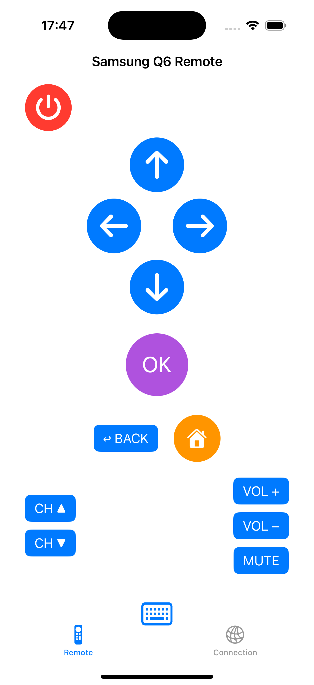
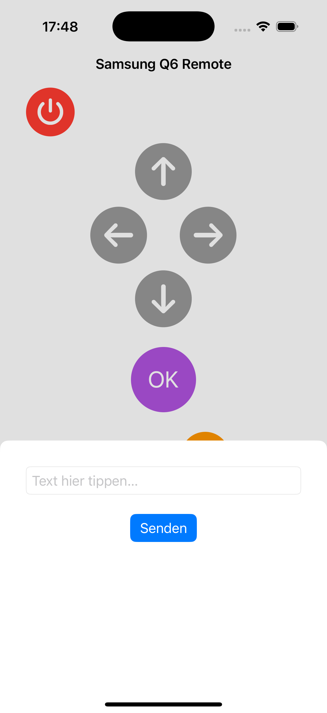
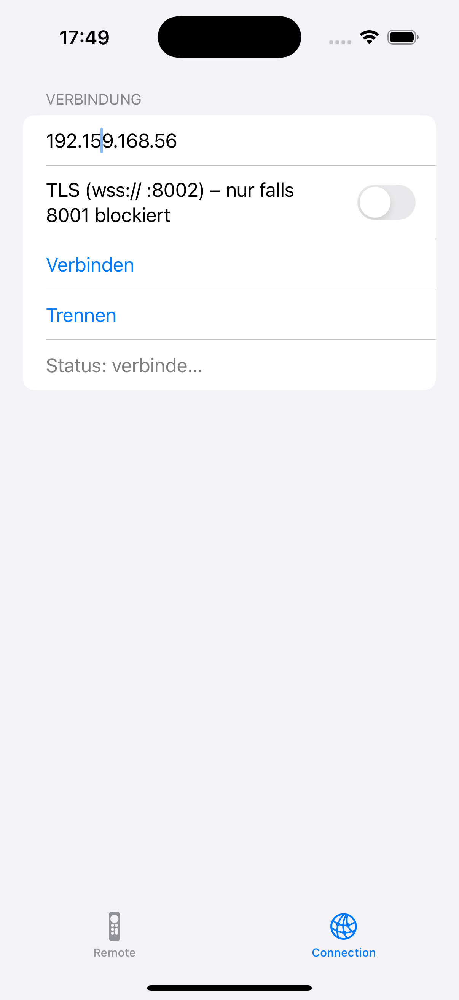

# 📺 Telicommand – Deine TV Fernbedienung als App

**Telicommand** ist eine iOS-App, die es ermöglicht, deinen Samsung Smart TV direkt mit dem iPhone oder iPad zu steuern – ganz ohne physische Fernbedienung.  
Die App verbindet sich über das lokale Netzwerk mit deinem Fernseher und bietet dir einfache Buttons für Navigation, Lautstärke, Texteingabe und Power.

---

<p align="center">
   
   
  
  
</p>

## ✨ Features
- 🔗 Verbindung zum Samsung Smart TV über **WebSocket (Samsung Remote API)**
- 🎛 Steuerung von Tasten wie Lautstärke, Kanäle und Navigation (`KEY_*`-Kommandos)
- ⌨️ Eingabe von Texten direkt auf dem TV (Base64-encoded Input)
- ⚡️ **Power Toggle** (An/Aus schalten)
- 📱 Einfache SwiftUI-Oberfläche mit Buttons für die wichtigsten Aktionen
- 🛡 Unterstützt auch TLS-Verbindungen (für TVs mit SSL)

---

## 🛠 Technologien
- **Swift** / **SwiftUI** für die Benutzeroberfläche
- **URLSessionWebSocketTask** für die Kommunikation mit dem Fernseher  
- **Base64 Encoding** für Texteingaben  
- **UserDefaults** zur Speicherung des Tokens nach erfolgreicher Kopplung

---

## 🚀 Installation & Nutzung
1. Repository klonen:
   ```bash
   git clone https://github.com/FrancescoSallia/Telicommand_iOS.git
